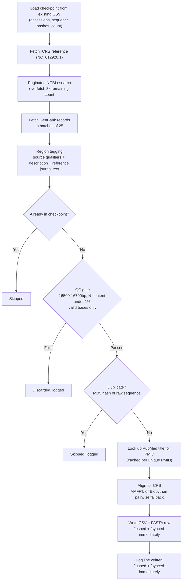

# 🧬 MitoHarvest: NCBI Mitogenome Retrieval, QC & rCRS Alignment Pipeline

**MitoHarvest** queries NCBI GenBank for human mitochondrial genomes from a target country, filters them through strict length/quality checks, deduplicates identical sequences, tags each with a best-effort geographic region and its source publication, aligns every accepted genome to the revised Cambridge Reference Sequence (rCRS), and writes the result out as a FASTA cohort, a metadata CSV, and a full audit log. Every write hits disk immediately, and the run is checkpointed — interrupt it at any point and rerunning resumes instead of starting over or overwriting what you already have.

---

## 🗺️ Architecture



Nothing is batched to the end of the run — every accepted record hits disk (CSV, FASTA, and log) the moment it's processed, so an interrupted run still leaves you with everything fetched so far, and the next run picks up exactly where it left off.

---

## 📦 Module breakdown

| File | Responsibility |
|---|---|
| `config.py` | Every tunable in one place: rCRS accession, `TARGET_COUNT`, QC thresholds (`MIN_LENGTH`/`MAX_LENGTH`/`MAX_N_RATIO`), the NCBI `SEARCH_QUERY`, the region keyword list (`INDIA_REGIONS`), batch/page sizes, and output file paths. Loads `NCBI_EMAIL`/`NCBI_API_KEY` from `.env` via `python-dotenv`. |
| `logging_setup.py` | Configures the root logger exactly once, with a custom `FlushFileHandler` that flushes and `fsync`s after every log line so `pipeline.log` updates in real time instead of only on exit. |
| `ncbi_client.py` | Wraps Biopython's `Entrez` with a self-throttling delay between every call and exponential-backoff retries. Retries cover `HTTPError`/`URLError`, `http.client.HTTPException` (including `IncompleteRead`, a real chunked-transfer glitch NCBI's servers occasionally throw), `ConnectionError`, and timeouts. Also exposes `esummary()` for PubMed lookups, not just nucleotide `esearch`/`efetch`. |
| `search.py` | Paginates `esearch` to collect candidate accession IDs, over-fetching 3x the *remaining* target count (not the full target — see checkpointing below) since a chunk of candidates will fail QC or turn out to be duplicates. |
| `fetch.py` | Pulls full GenBank records in batches of 25, parses them with `SeqIO`, and tags each with a region by regex-matching the `source` feature qualifiers, the description, **and the submitting author's institution address** (`references[].journal`) against the keyword list in `config.py`. Also extracts the linked PMID, if any. |
| `qc.py` | Rejects anything outside the length window, anything with excessive ambiguous (`N`) bases, or anything with invalid characters. |
| `align.py` | Aligns each QC-passed sequence to the rCRS reference. Uses MAFFT (`--keeplength --add`) if it's on `PATH` — resolved via `shutil.which` and invoked at its *resolved* path, so it works whether that's `mafft` on Linux/macOS or `mafft.bat` on Windows. Falls back automatically to Biopython's `PairwiseAligner` if MAFFT isn't installed. |
| `export.py` | `ResultWriter` writes one CSV row and one FASTA entry per accepted record, flushing and `fsync`ing both after every write. `load_checkpoint()` reads an existing CSV back in on startup to rebuild the set of already-processed accessions, already-seen sequence hashes, and the running count, so a rerun resumes rather than restarts. |
| `main.py` | Orchestrates the whole run: load checkpoint → fetch rCRS → search remaining → fetch/tag → skip-if-checkpointed → QC → MD5-hash dedup → PubMed title lookup (cached per PMID) → align → write → log. Wrapped in try/except/finally so a crash mid-run still closes files cleanly and reports partial, resumable results instead of losing everything. |

---

## 💻 Setup & Installation

All three platforms follow the same shape: install Python + `uv`, clone, create a venv, install dependencies from `requirements.txt`. MAFFT (optional — see below) is the one step that differs meaningfully by OS.

### Windows (PowerShell)

```powershell
git clone https://github.com/AbdulRaffayQureshi/mitoharvest.git
cd mitoharvest
uv venv
.venv\Scripts\activate
uv pip install -r requirements.txt
```

> If PowerShell blocks activation with an execution policy error:
> ```powershell
> Set-ExecutionPolicy -ExecutionPolicy RemoteSigned -Scope CurrentUser
> ```

MAFFT has no native Windows pip/conda package — bioconda only ships Linux/macOS builds. It's entirely optional (the pipeline falls back to a pure-Python aligner without it), but if you want the faster path, download the signed Windows build from the [MAFFT site](https://mafft.cbrc.jp/alignment/software/windows.html), extract it somewhere permanent (not `%TEMP%`, which Windows periodically clears), and add that folder to your user `PATH`. Windows builds ship as `mafft.bat`, but no code changes are needed — `shutil.which("mafft")` resolves the `.bat` automatically since `.BAT` is in `PATHEXT`.

### macOS

```bash
brew install python uv mafft
git clone https://github.com/AbdulRaffayQureshi/mitoharvest.git
cd mitoharvest
uv venv
source .venv/bin/activate
uv pip install -r requirements.txt
mafft --version
```

MAFFT installs cleanly via Homebrew here — no workaround needed.

### Linux / WSL

```bash
sudo apt update
sudo apt install -y python3 python3-venv python3-pip mafft
git clone https://github.com/AbdulRaffayQureshi/mitoharvest.git
cd mitoharvest
uv venv
source .venv/bin/activate
uv pip install -r requirements.txt
mafft --version
```

If `uv` isn't installed yet:

```bash
curl -LsSf https://astral.sh/uv/install.sh | sh
```

Add `~/.local/bin` to your shell's `PATH` afterward — via `~/.bashrc` if you use bash, or `~/.zshrc` if you use zsh (check with `echo $SHELL`; sourcing the wrong one just produces harmless-looking garbage in your prompt, not a real error).

**MAFFT is easiest here** — a single `apt`/`brew` install versus manually downloading and pathing a zip on Windows — so if alignment speed matters to you and you have the option, running the pipeline from WSL or native Linux/macOS is the path of least resistance.

---

## 📦 Dependencies (`requirements.txt`)

```
biopython>=1.83
python-dotenv>=1.0
```

That's the complete list — `biopython` covers Entrez, `SeqIO`, and the pairwise aligner; `python-dotenv` loads your `.env`. Everything else the code uses (`csv`, `hashlib`, `logging`, `os`, `io`, `subprocess`, `shutil`, `tempfile`, `http.client`, `socket`) is Python's standard library, so nothing else to install. Anyone cloning the repo gets every dependency with the single command already shown above:

```bash
uv pip install -r requirements.txt
```

MAFFT is deliberately *not* in this file since it isn't a Python package — see the OS-specific install steps above.

---

## 🔑 Environment Configuration (`.env`)

```ini
NCBI_EMAIL=your.name@example.com
NCBI_API_KEY=your_personal_ncbi_api_key
```

| Variable | Required? | Purpose |
|---|---|---|
| `NCBI_EMAIL` | ✅ Yes | NCBI requires an email on all Entrez requests. |
| `NCBI_API_KEY` | ⚠️ Strongly recommended | Raises the rate limit from 3 to 10 req/sec and reduces throttling on large fetches. Get one free from [NCBI account settings](https://www.ncbi.nlm.nih.gov/account/settings/). |

---

## 🔍 Inspecting a raw GenBank record

Useful whenever a query's results look off, or you want to see exactly what metadata a given accession actually carries before trusting a keyword-based filter:

```bash
uv run python -c "
from Bio import Entrez
Entrez.email = 'you@example.com'
h = Entrez.efetch(db='nucleotide', id='PV658278.1', rettype='gb', retmode='text')
print(h.read())
"
```

Swap in any accession. This is how we confirmed that GenBank's `/geo_loc_name` field for Indian submissions is almost always just `"India"` with no state/city — but the `REFERENCE`/`JOURNAL` block (the submitting lab's address) often does name a specific city and state, which is why `fetch.py` scans that text too.

---

## 🌍 Retargeting the pipeline at a different country

Edit `config.py`:

```python
SEARCH_QUERY = (
    '"Homo sapiens"[Organism] AND '
    'mitochondrion[Filter] AND '
    'complete genome[Title] AND '
    'India[Country]'          # change this
)

INDIA_REGIONS = [             # replace with the target country's state/city keywords
    "Punjab", "Delhi", "Mumbai", ...
]
```

The `[Country]` tag controls what NCBI's index returns. `INDIA_REGIONS` drives sub-national region tagging in `fetch.py` — best-effort only, since GenBank rarely tags sub-national geography in a structured field, so many records will still land as `"<Country> (unspecified)"` no matter how thorough the keyword list is.

You can also restrict the search itself to only records that mention a region by name, by building an OR clause from the same list:

```python
REGION_FILTER = " OR ".join(f'"{r}"[All Fields]' for r in INDIA_REGIONS)
SEARCH_QUERY = (
    '"Homo sapiens"[Organism] AND '
    'mitochondrion[Filter] AND '
    'complete genome[Title] AND '
    'India[Country] AND '
    f'({REGION_FILTER})'
)
```

This guarantees every match names a region, but shrinks the candidate pool drastically — most GenBank submissions don't mention one at all. Check `esearch`'s `Count` for your query before committing to a full-size run with this approach.

Other tunables worth knowing about in `config.py`:
- `TARGET_COUNT` — how many QC-passed, deduplicated genomes to collect in total (not per run — see checkpointing)
- `MIN_LENGTH` / `MAX_LENGTH` — currently 16500–16700 bp
- `MAX_N_RATIO` — currently 1% ambiguous-base tolerance
- `OVERFETCH_FACTOR` — how many extra candidate IDs to pull relative to what's still needed, to absorb QC/dedup losses

---

## 🔁 Checkpointing & resuming

If `main.py` crashes, is interrupted, or you simply stop it, your progress isn't lost. On the next run, `load_checkpoint()` reads the existing `mitovarsitypak_india.csv`, rebuilds the set of accessions and sequence hashes already saved, and `main.py` only searches for `TARGET_COUNT - already_saved` more — appending to the same CSV/FASTA instead of overwriting them.

> ⚠️ If you change the CSV's column schema (e.g. adding new fields), rename or delete the old CSV/FASTA first — resuming into a file with a mismatched header will misalign columns:
> ```bash
> mv mitovarsitypak_india.csv mitovarsitypak_india.csv.bak
> mv mitovarsitypak_india.fasta mitovarsitypak_india.fasta.bak
> ```

---

## ▶️ Execution & Outputs

```bash
uv run python main.py
```

| Output File | Description |
|---|---|
| `mitovarsitypak_india.fasta` | One FASTA entry per accepted record, aligned to rCRS. |
| `mitovarsitypak_india.csv` | `accession, region, length, pubmed_id, pubmed_title, raw_sequence, aligned_sequence, description` for every accepted record. |
| `pipeline.log` | Full audit trail — every acceptance, every QC rejection, every duplicate/checkpoint skip, PubMed lookups, and any crash traceback, each with a timestamp, updated live as the run progresses. |

---

## ⚠️ Known limitations

- **Region tagging is best-effort.** NCBI GenBank rarely tags Indian (or most countries') sub-national geography in a structured field. `fetch.py` also scans the submitting author's institution address for a location, which helps but is a proxy for where the lab is, not necessarily where the sample came from — expect a meaningful share of `"India (unspecified)"` results regardless.
- **`esearch`'s reported `Count` can disagree with what pagination actually returns.** Before scaling `TARGET_COUNT` way up, check how many matching records actually exist for your query — `TARGET_COUNT * OVERFETCH_FACTOR` may exceed what NCBI can supply, in which case the run simply exhausts its candidate pool early.
- **PubMed titles aren't guaranteed.** Not every accession has a linked PMID, and `esummary` lookups can occasionally fail for a given PMID — both cases fall back to `"NA"` rather than blocking the run.