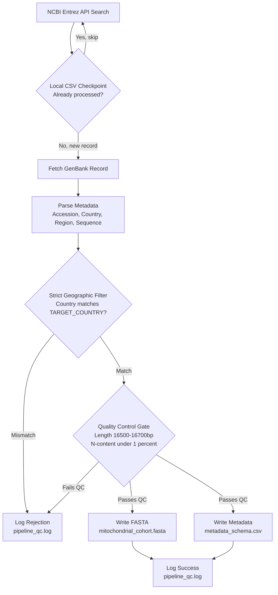

# 🧬 MitoHarvest: Automated Human Mitogenome Retrieval & QC Pipeline

**MitoHarvest** is a resilient, checkpointed Python pipeline that queries NCBI GenBank for human mitochondrial DNA sequences, enforces strict geographic and quality-control benchmarks, and produces a clean, analysis-ready cohort — a FASTA file, a metadata CSV, and a full audit log.

No more manually screening GenBank hits for mislabeled countries, truncated genomes, or N-heavy garbage reads. MitoHarvest does it for you, automatically, every run.

---

## 🗺️ Methodology

The pipeline is checkpointed (so re-runs skip already-processed accessions) and gated by two independent filters — a **geographic filter** and a **quality control filter** — before anything touches disk.



---

## 💻 Windows Setup & Installation

These instructions assume you're using **PowerShell** and have [`uv`](https://github.com/astral-sh/uv) installed for fast, reliable environment management.

### 1. Clone the repository

```powershell
git clone https://github.com/AbdulRaffayQureshi/mitoharvest.git
cd mitoharvest
```

### 2. Create a virtual environment

```powershell
uv venv
```

### 3. Activate the environment

```powershell
.venv\Scripts\activate
```

> If PowerShell blocks the activation script with an execution policy error, run:
> ```powershell
> Set-ExecutionPolicy -ExecutionPolicy RemoteSigned -Scope CurrentUser
> ```

### 4. Install dependencies

```powershell
uv pip install biopython python-dotenv pandas
```

---

## 🔑 Environment Configuration (`.env`)

The pipeline authenticates against NCBI's Entrez API using your email address, and optionally an API key to raise your rate limit from 3 requests/sec to 10 requests/sec.

### Step 1: Duplicate the example file

In Windows Explorer, copy `.env.example` and rename the copy to `.env`. Or, from PowerShell:

```powershell
Copy-Item .env.example .env
```

### Step 2: Edit `.env`

Open `.env` in VS Code:

```powershell
code .env
```

Fill in your details:

```ini
NCBI_EMAIL=your.name@company.com
NCBI_API_KEY=your_personal_ncbi_api_key
```

| Variable | Required? | Purpose |
|---|---|---|
| `NCBI_EMAIL` | ✅ Yes | NCBI requires an email on all Entrez requests. Runs will fail without it. |
| `NCBI_API_KEY` | ⚠️ Strongly recommended | Raises your rate limit and drastically reduces `429 Too Many Requests` errors on large fetches. Get one free from your [NCBI account settings](https://www.ncbi.nlm.nih.gov/account/settings/). |

---

## 🌍 How to Target a Different Country

By default, the pipeline is configured to harvest sequences sourced from **India**. To retarget it at a different country (e.g., **Bangladesh**), you need to update **two variables** in `fetch_pipeline.py` so the Entrez search and the post-fetch verification filter stay in sync.

### Variable 1 — `SEARCH_TERM`

Update the `[Country]` tag inside the Entrez query string:

```python
# Before
SEARCH_TERM = (
    'Homo sapiens[Organism] AND mitochondrion[Filter] '
    'AND India[Country] AND 16000:17000[Sequence Length]'
)

# After
SEARCH_TERM = (
    'Homo sapiens[Organism] AND mitochondrion[Filter] '
    'AND Bangladesh[Country] AND 16000:17000[Sequence Length]'
)
```

### Variable 2 — `TARGET_COUNTRY`

Update the strict post-fetch verification string:

```python
# Before
TARGET_COUNTRY = "India"

# After
TARGET_COUNTRY = "Bangladesh"
```

> ⚠️ **Both variables must match.** `SEARCH_TERM` controls what NCBI's search index returns; `TARGET_COUNTRY` is the independent safety check applied after every record is parsed. NCBI's `[Country]` search field is known to be unreliable and can leak neighboring or mislabeled countries — the `TARGET_COUNTRY` check exists specifically to catch that, so skipping it defeats the purpose of the filter.

---

## ▶️ Execution & Outputs

Run the pipeline from your activated virtual environment:

```powershell
python fetch_pipeline.py
```

The script will search NCBI, checkpoint against prior runs, fetch and QC each candidate record, and write three output files to the project directory:

| Output File | Description |
|---|---|
| **`mitochondrial_cohort.fasta`** | The clean sequence cohort — one FASTA entry per record that passed both the geographic and QC filters, wrapped at 70 characters per line. |
| **`metadata_schema.csv`** | Structured metadata for every accepted record: `Accession_ID`, `Country`, `Region`, `Length`, `N_Count`, and `N_Fraction`. Also acts as the checkpoint file for future runs. |
| **`pipeline_qc.log`** | The full audit trail — every accepted record, every rejection (country mismatch, length out of range, excessive N-content), and any fetch/network failures, each with a specific reason and timestamp. |

Re-running the script is safe: accessions already present in `metadata_schema.csv` are automatically skipped, so you can resume an interrupted fetch or extend an existing cohort without duplicating records.