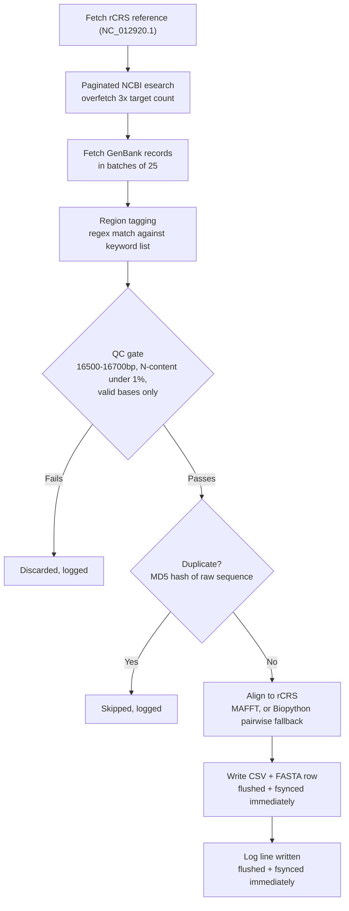

# 🧬 MitoHarvest: NCBI Mitogenome Retrieval, QC & rCRS Alignment Pipeline

**MitoHarvest** queries NCBI GenBank for human mitochondrial genomes from a target country, filters them through strict length/quality checks, deduplicates identical sequences, aligns every accepted genome to the revised Cambridge Reference Sequence (rCRS), and writes the result out as a FASTA cohort, a metadata CSV, and a full audit log — with rate-limiting built in so large fetches don't get your IP throttled or blocked by NCBI.

---

## 🗺️ Architecture



Nothing is batched to the end of the run — every accepted record hits disk (CSV, FASTA, and log) the moment it's processed, so an interrupted run still leaves you with everything fetched so far.

---

## 📦 Module breakdown

| File | Responsibility |
|---|---|
| `config.py` | Every tunable in one place: rCRS accession, `TARGET_COUNT`, QC thresholds (`MIN_LENGTH`/`MAX_LENGTH`/`MAX_N_RATIO`), the NCBI `SEARCH_QUERY`, the region keyword list, batch/page sizes, and output file paths. Loads `NCBI_EMAIL`/`NCBI_API_KEY` from `.env` via `python-dotenv`. |
| `logging_setup.py` | Configures the root logger once, with a custom `FlushFileHandler` that flushes and `fsync`s after every log line so `pipeline.log` updates in real time instead of only on exit. |
| `ncbi_client.py` | Wraps Biopython's `Entrez` with a self-throttling delay between every call and exponential-backoff retries on network errors — the core defense against NCBI rate-limiting or IP blocks. |
| `search.py` | Paginates `esearch` to collect candidate accession IDs, over-fetching 3x the target count since a chunk of candidates will fail QC or turn out to be duplicates. |
| `fetch.py` | Pulls full GenBank records in batches of 25, parses them with `SeqIO`, and tags each with a region by regex-matching the `source` feature qualifiers + description against the keyword list in `config.py`. |
| `qc.py` | Rejects anything outside the length window, anything with excessive ambiguous (`N`) bases, or anything with invalid characters. |
| `align.py` | Aligns each QC-passed sequence to the rCRS reference. Uses MAFFT (`--keeplength --add`) if it's on `PATH` (resolved via `shutil.which`, so it works whether that resolves to `mafft` on Linux or `mafft.bat` on Windows); falls back automatically to Biopython's `PairwiseAligner` if MAFFT isn't installed. |
| `export.py` | `ResultWriter` — writes one CSV row and one FASTA entry per accepted record, flushing and `fsync`ing both after every write. |
| `main.py` | Orchestrates the whole run: fetch rCRS → search → fetch/tag → QC → **MD5-hash dedup check** → align → write → log. Wrapped in try/except/finally so a crash mid-run still closes files cleanly and reports partial results instead of losing everything. |

---

## 💻 Windows Setup & Installation

Assumes **PowerShell** with [`uv`](https://github.com/astral-sh/uv) installed.

```powershell
git clone https://github.com/AbdulRaffayQureshi/mitoharvest.git
cd mitoharvest
uv venv
.venv\Scripts\activate
uv pip install -r requirements.txt
```

> If PowerShell blocks activation with an execution policy error:
> ```powershell
> Set-ExecutionPolicy -ExecutionPolicy RemoteSigned -Scope CurrentUser
> ```

MAFFT has no native Windows pip package. It's optional — the pipeline falls back to a pure-Python aligner without it — but if you want the faster path, download the Windows build from the [MAFFT site](https://mafft.cbrc.jp/alignment/software/windows.html) and add it to your `PATH`.

---

## 🐧 WSL / Linux Setup & Installation

WSL's `.venv` is separate from any Windows one — create a fresh one here.

```bash
sudo apt update
sudo apt install -y python3 python3-venv python3-pip mafft
git clone https://github.com/AbdulRaffayQureshi/mitoharvest.git
cd mitoharvest
uv venv
source .venv/bin/activate
uv pip install -r requirements.txt
mafft --version
```

If `uv` isn't installed yet:

```bash
curl -LsSf https://astral.sh/uv/install.sh | sh
```

(Add `~/.local/bin` to your shell's `PATH` afterward — via `~/.bashrc` for bash or `~/.zshrc` for zsh, matching whichever shell you're actually running.)

MAFFT installs cleanly via `apt` here, unlike Windows, so this is the simpler path if you want the fast alignment method.

---

## 🔑 Environment Configuration (`.env`)

The pipeline authenticates against NCBI's Entrez API with an email, and optionally an API key to raise the rate limit from 3 req/sec to 10 req/sec.

```ini
NCBI_EMAIL=your.name@example.com
NCBI_API_KEY=your_personal_ncbi_api_key
```

| Variable | Required? | Purpose |
|---|---|---|
| `NCBI_EMAIL` | ✅ Yes | NCBI requires an email on all Entrez requests. |
| `NCBI_API_KEY` | ⚠️ Strongly recommended | Raises the rate limit and reduces the chance of throttling on large fetches. Get one free from [NCBI account settings](https://www.ncbi.nlm.nih.gov/account/settings/). |

---

## 🌍 Retargeting the pipeline at a different country

Edit `config.py`:

```python
SEARCH_QUERY = (
    '"Homo sapiens"[Organism] AND '
    'mitochondrion[Filter] AND '
    'complete genome[Title] AND '
    'India[Country]'          # change this
)

INDIA_REGIONS = [             # replace with the target country's state/city keywords
    "Punjab", "Delhi", "Mumbai", ...
]
```

`SEARCH_QUERY`'s `[Country]` tag controls what NCBI's index returns for the fetch. The keyword list drives sub-national region tagging in `fetch.py` — it's best-effort only, since GenBank doesn't reliably tag Indian (or most countries') sub-national geography, so many records will land as `"<Country> (unspecified)"` regardless of how thorough the keyword list is.

Other tunables worth knowing about in `config.py`:
- `TARGET_COUNT` — how many QC-passed, deduplicated genomes to collect
- `MIN_LENGTH` / `MAX_LENGTH` — currently 16500–16700 bp
- `MAX_N_RATIO` — currently 1% ambiguous-base tolerance
- `OVERFETCH_FACTOR` — how many extra candidate IDs to pull relative to `TARGET_COUNT`, to absorb QC/dedup losses

---

## ▶️ Execution & Outputs

```bash
python main.py
```

| Output File | Description |
|---|---|
| `mitovarsitypak_india.fasta` | One FASTA entry per accepted record, aligned to rCRS. |
| `mitovarsitypak_india.csv` | `accession, region, length, raw_sequence, aligned_sequence, description` for every accepted record. |
| `pipeline.log` | Full audit trail — every acceptance, every QC rejection, every duplicate skip, and any crash traceback, each with a timestamp, updated live as the run progresses. |

---

## ⚠️ Known limitations

- **Region tagging is best-effort.** NCBI GenBank rarely tags Indian (or most countries') sub-national geography in a structured field, so expect a large share of `"India (unspecified)"` results regardless of keyword list size.
- **`esearch`'s reported `Count` can disagree with what pagination actually returns.** Before scaling `TARGET_COUNT` way up, check how many matching records actually exist for your query — `TARGET_COUNT * OVERFETCH_FACTOR` may exceed what NCBI can supply, in which case the run will simply exhaust its candidate pool early.